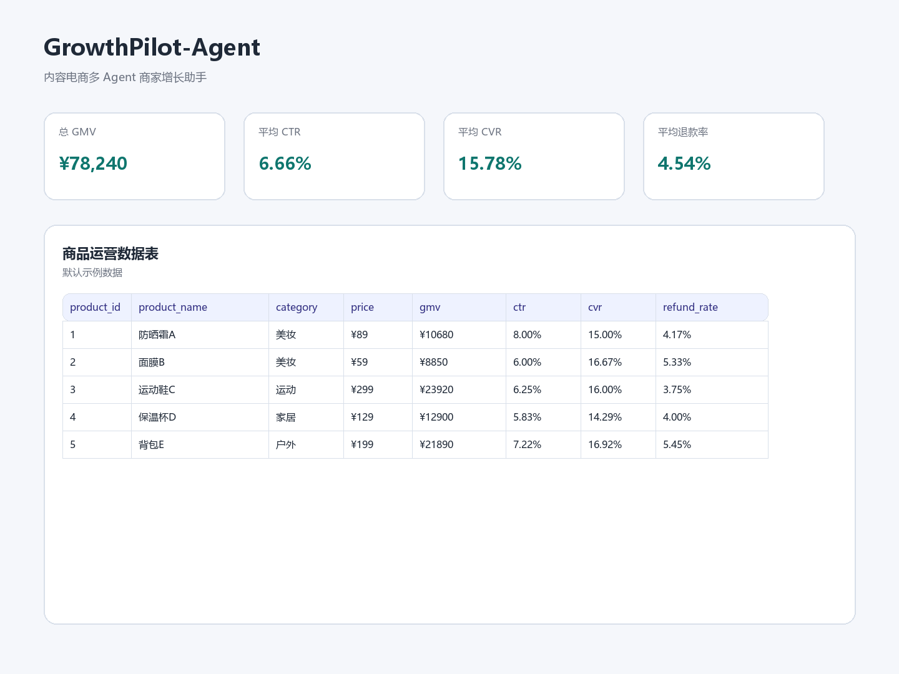
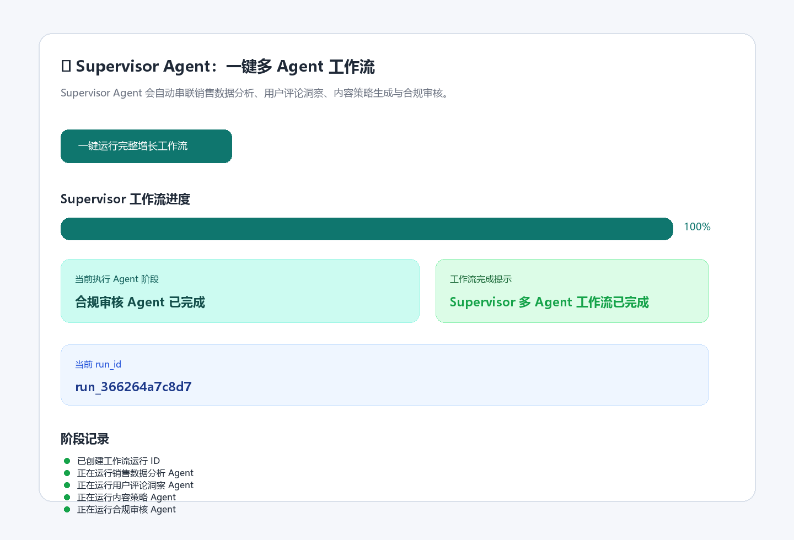
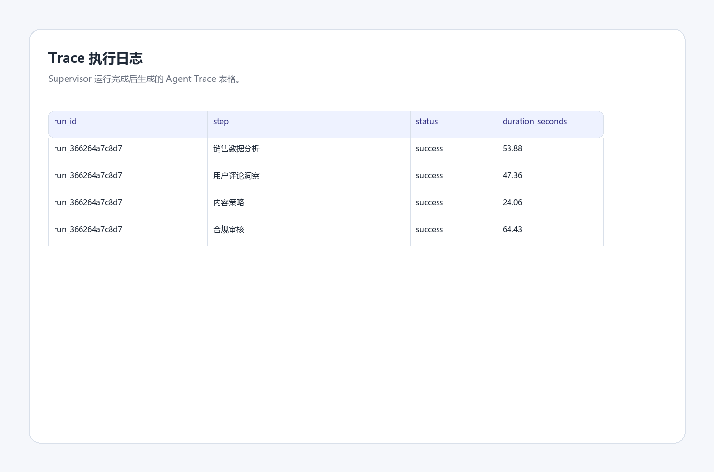
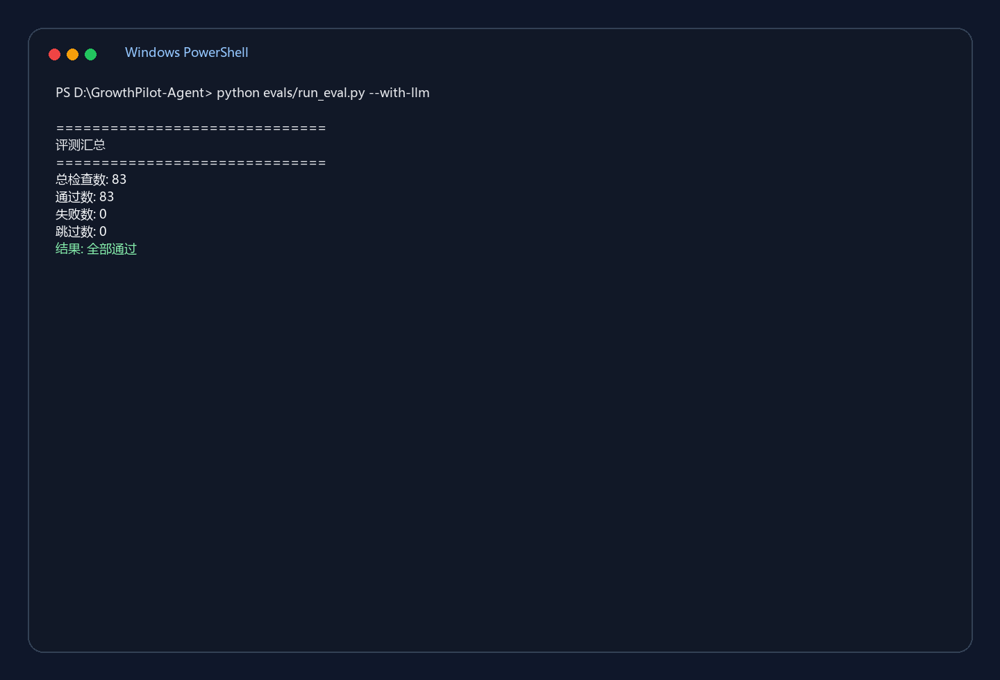
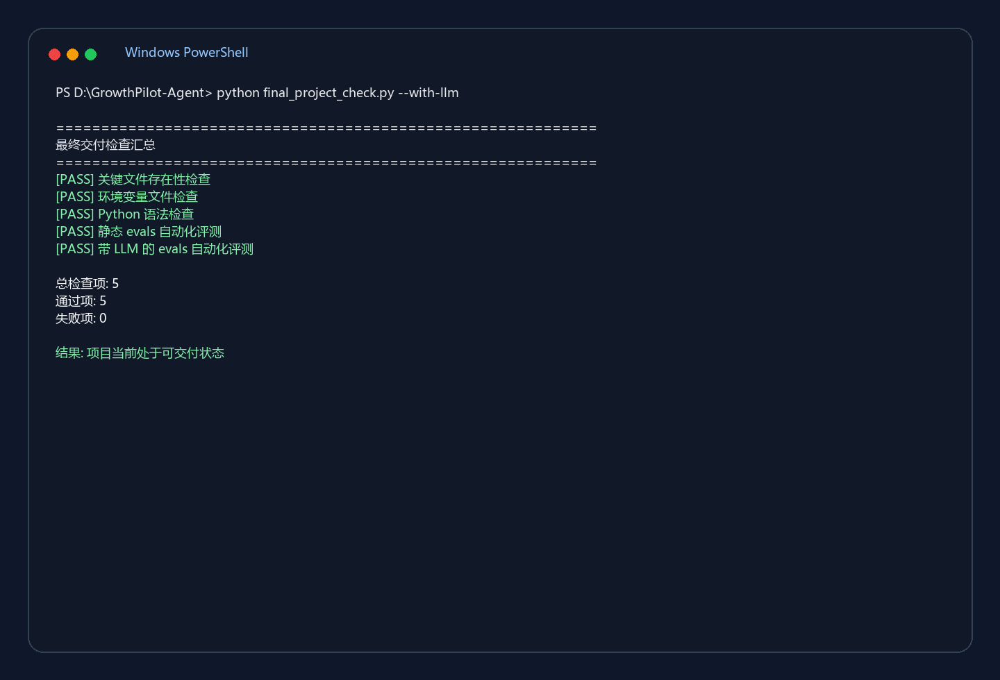

# GrowthPilot-Agent

GrowthPilot-Agent 是一个面向内容电商场景的多 Agent 商家增长助手。

项目模拟小红书 / 抖音 / 内容电商平台中的商家运营流程，基于商品数据、销售数据和用户评论，自动完成经营分析、用户洞察、批量增长策略生成、内容策略生成、合规审核、Agent Trace 记录和增长报告导出。

本项目不是普通的“AI 文案生成器”，而是一个包含多 Agent 工作流、Supervisor 调度、Prompt 模板管理、Agent Trace 可观测性、工作流 run_id 追踪、Supervisor 工作流进度展示、CSV 模板下载、CSV 上传、上传字段校验、Markdown 报告导出与下载、Agent Trace JSON 导出与下载、环境变量配置化、模型参数配置化、evals 自动化评测、`.gitignore` 安全上传控制和最终交付检查脚本的 Agent 应用工程项目。

---

## 1. 项目背景

在内容电商场景中，商家和运营人员通常需要完成以下工作：

1. 分析商品销售表现
2. 理解用户评论和真实痛点
3. 对多个商品进行优先级排序和分层运营
4. 生成适合小红书、抖音等平台的内容策略
5. 检查内容是否存在夸大宣传、绝对化用语或违规风险
6. 输出可复盘的运营报告
7. 记录 Agent 执行过程，方便调试和复盘
8. 通过运行 ID 追踪每一次多 Agent 工作流
9. 在页面中展示工作流执行进度，提升交互体验
10. 通过环境变量管理模型配置，提升部署和迁移便利性
11. 在项目交付前一键检查关键文件、语法和评测结果
12. 通过 `.gitignore` 防止密钥、缓存和运行产物被误传到 GitHub

传统方式依赖人工分析，效率较低。GrowthPilot-Agent 通过多 Agent 协作，将这些流程自动化，形成从数据分析、用户洞察、批量增长策略、内容生成、合规审核到 Trace 记录和报告交付的完整闭环。

---

## 2. 核心功能

当前项目已经实现：

- 商品、销售、评论数据读取
- GMV、CTR、CVR、退款率等运营指标计算
- Streamlit 页面侧边栏 CSV 模板下载
- Streamlit 页面侧边栏 CSV 上传
- 上传 CSV 字段校验
- examples 上传示例数据
- 销售数据分析 Agent
- 用户评论洞察 Agent
- 多商品批量增长分析 Agent
- 内容策略 Agent
- 合规审核 Agent
- Supervisor 多 Agent 工作流
- 工作流 run_id 唯一运行编号
- Supervisor 工作流进度展示
- Agent Trace 执行日志面板
- Agent Trace JSON 导出与下载
- Prompt 模板文件管理
- Markdown 增长报告导出与下载
- `.env.example` 环境变量示例配置
- Qwen 模型名称配置化
- Qwen temperature 参数配置化
- evals 自动化评测模块
- LLM 服务不可用时自动 SKIP 机制
- final_project_check.py 最终交付检查脚本
- `.gitignore` 安全上传控制

---

## 3. 项目亮点

### 3.1 多 Agent 协作

项目将复杂运营任务拆成多个专业 Agent：

| Agent | 作用 |
|---|---|
| Sales Analysis Agent | 分析 GMV、CTR、CVR、退款率等经营指标 |
| User Insight Agent | 从用户评论中提取痛点、正反馈、负反馈和内容机会 |
| Batch Growth Agent | 对多个商品进行优先级排序、分层策略和批量增长动作推荐 |
| Content Strategy Agent | 生成小红书标题、正文、抖音脚本和发布建议 |
| Compliance Agent | 审核内容中的合规风险 |
| Supervisor Agent | 串联多个专业 Agent，形成完整工作流 |

---

### 3.2 Supervisor 多 Agent 工作流

Supervisor Agent 会自动调度以下流程：

```text
销售数据分析
    ↓
用户评论洞察
    ↓
内容策略生成
    ↓
内容合规审核
    ↓
生成完整增长报告
    ↓
导出 Agent Trace JSON
```

每次运行 Supervisor 工作流时，系统都会生成一个唯一的 `run_id`，用于追踪本次工作流运行、Trace 日志、Markdown 报告和 JSON 结构化日志。

Supervisor 工作流还支持 `progress_callback` 进度回调。前端可以将进度更新函数传给 Supervisor，Supervisor 在执行不同 Agent 阶段时通知页面更新进度条和当前执行状态。

这使项目从“多个独立按钮”升级为“可追踪、可观测、有进度反馈的多 Agent 工作流系统”。

---

### 3.3 多商品批量增长分析

项目新增 Batch Growth Agent，支持用户同时选择多个商品，并结合：

- GMV
- CTR
- CVR
- refund_rate
- 用户评论反馈

输出：

- 商品优先级排序
- 商品分层策略
- 每个商品的核心问题
- 每个商品的增长机会
- 小红书内容方向
- 抖音短视频方向
- 下一步运营动作

该能力让系统从“单商品内容生成”升级为“多商品运营决策辅助”。

---

### 3.4 Agent Trace 可观测性

Supervisor 工作流会记录每个 Agent 的执行日志，包括：

- run_id 运行编号
- Agent 名称
- 执行说明
- 输入摘要
- 执行状态
- 执行耗时
- 输出预览
- 错误信息

这有助于定位问题，也更接近真实 Agent 平台中的可观测性能力。

项目同时支持将 Agent Trace 导出为 JSON 文件：

```text
outputs/agent_trace.json
```

Trace JSON 中包含：

- 生成时间
- run_id
- 当前分析商品
- 工作流名称
- 每个 Agent 的执行日志
- 每个 Agent 的输入摘要
- 每个 Agent 的执行状态、耗时、输出预览和错误信息

Markdown 报告适合人阅读，Trace JSON 更适合后续程序读取、任务复盘、调试和平台化接入。

---

### 3.5 Prompt 模板管理

项目将 Prompt 从 Python 代码中拆出，统一放在：

```text
app/prompts/
```

这样可以做到：

- Prompt 和业务代码解耦
- 方便单独调试 Prompt
- 方便后续版本迭代
- 更符合工程化开发习惯

---

### 3.6 CSV 上传、模板下载与字段校验

项目支持在 Streamlit 页面侧边栏上传：

```text
product.csv
sales.csv
comments.csv
```

为了降低用户接入成本，页面侧边栏同时提供 CSV 模板下载按钮：

```text
下载 product.csv 模板
下载 sales.csv 模板
下载 comments.csv 模板
```

用户可以先下载模板，按照模板字段填写自己的业务数据，再上传到系统中。

上传后系统会自动检查字段是否完整。

如果字段缺失，例如 `product.csv` 缺少 `product_name`，页面会提示：

```text
product.csv 缺少字段：product_name
```

如果上传不完整或字段校验失败，系统会自动回退到默认示例数据，避免页面崩溃。

---

### 3.7 环境变量与模型配置工程化

项目通过 `.env` 和 `.env.example` 管理大模型配置。

`.env.example` 中提供了完整示例：

```env
DASHSCOPE_API_KEY=your_dashscope_api_key_here
DASHSCOPE_BASE_URL=https://dashscope.aliyuncs.com/compatible-mode/v1
QWEN_MODEL=qwen-plus
QWEN_TEMPERATURE=0.7
```

其中：

| 配置项 | 作用 |
|---|---|
| DASHSCOPE_API_KEY | DashScope API Key |
| DASHSCOPE_BASE_URL | DashScope OpenAI 兼容模式地址 |
| QWEN_MODEL | 通义千问模型名称 |
| QWEN_TEMPERATURE | 控制生成内容随机性 |

项目在 `app/config.py` 中统一读取环境变量，在 `app/llm.py` 中统一创建大模型客户端并调用通义千问模型。

`call_qwen()` 支持以下调用方式：

```python
call_qwen(prompt)
```

也支持临时覆盖模型参数：

```python
call_qwen(prompt, model="qwen-plus", temperature=0.2)
```

这样可以做到：

- API Key 不写进代码
- 模型名称不写死
- temperature 参数不写死
- 不同 Agent 可以按需使用不同生成随机性
- 项目部署和迁移更加方便

---

### 3.8 evals 自动化评测

项目提供 `evals` 模块，可以自动检查：

- 默认数据文件是否存在
- 默认数据列是否完整
- 默认运营指标是否生成
- examples 上传示例文件是否存在
- examples 上传示例字段是否完整
- examples 上传示例是否能正常生成运营指标
- Agent 文件是否存在
- `.env.example` 是否存在
- `final_project_check.py` 是否存在
- `.env.example` 是否包含关键环境变量
- `app/config.py` 是否包含关键配置项
- `app/llm.py` 是否包含大模型调用函数
- `call_qwen()` 是否支持 `model` 参数
- `call_qwen()` 是否支持 `temperature` 参数
- Prompt 模板文件是否存在
- Prompt 模板变量是否正确
- Prompt 是否能正常渲染
- supervisor_agent 模块是否能正常导入
- Supervisor 核心函数是否存在
- run_id 生成格式是否正确
- run_supervisor_workflow 是否支持 progress_callback 参数
- notify_progress 是否能正常触发进度回调
- report_service 模块是否能正常导入
- Markdown 报告导出函数是否存在
- Agent Trace JSON 导出函数是否存在
- Agent Trace JSON 文件是否能正常生成
- Agent Trace JSON 顶层字段是否完整
- Agent Trace JSON 中 run_id 是否正确
- Agent Trace JSON 中 selected_product 是否正确
- Agent Trace JSON 中 traces 是否为非空列表
- Agent Trace JSON 单条日志字段是否完整
- Agent Trace JSON 单条日志 run_id 是否正确
- 合规审核 Agent 是否能识别高风险内容

当前静态评测结果：

```text
总检查数: 80
通过数: 80
失败数: 0
跳过数: 0
结果: 全部通过
```

带 LLM 评测结果：

```text
总检查数: 83
通过数: 83
失败数: 0
跳过数: 0
结果: 全部通过
```

如果 DashScope 欠费、额度不足、无权限或服务不可用，LLM 用例会自动标记为 SKIP：

```text
总检查数: 80
通过数: 80
失败数: 0
跳过数: 3
结果: 部分 LLM 用例因服务不可用被跳过，其余全部通过
```

---

### 3.9 最终交付检查脚本

项目新增：

```text
final_project_check.py
```

该脚本用于项目交付前的一键检查。

不带 LLM 的检查命令：

```bash
python final_project_check.py
```

带 LLM 的检查命令：

```bash
python final_project_check.py --with-llm
```

它会自动执行：

- 关键文件存在性检查
- `.env.example` 文件检查
- `.env` 本地配置检查
- 核心 Python 文件语法检查
- 静态 evals 自动化评测
- 可选带 LLM 的 evals 自动化评测

当前最终交付检查结果：

```text
不带 LLM：4 / 4 通过
带 LLM：5 / 5 通过
结果：项目当前处于可交付状态
```

这个脚本适合在以下场景使用：

- 上传 GitHub 前
- 面试演示前
- 修改代码后做最终检查
- 确认项目是否处于可交付状态

---

### 3.10 .gitignore 安全上传控制

项目通过 `.gitignore` 控制不应上传 GitHub 的文件，包括：

```text
.env
.env.*
outputs/
__pycache__/
*.pyc
.streamlit/secrets.toml
requirements_freeze.txt
```

其中：

| 文件或目录 | 处理方式 | 原因 |
|---|---|---|
| `.env` | 忽略 | 包含真实 API Key |
| `.env.example` | 保留 | 示例配置，需要上传 |
| `outputs/` | 忽略 | 运行时报告和 Trace JSON |
| `__pycache__/` | 忽略 | Python 缓存 |
| `.streamlit/secrets.toml` | 忽略 | 可能包含密钥 |
| `requirements_freeze.txt` | 忽略 | 本地冻结依赖，不作为项目主依赖 |

可以用以下命令检查忽略规则：

```bash
git check-ignore -v .env
git check-ignore -v outputs/agent_trace.json
git check-ignore -v __pycache__/test.pyc
git check-ignore -v .env.example
```

其中 `.env.example` 没有输出，说明它不会被忽略，可以安全上传到 GitHub。

---

## 4. 项目截图

截图文件位于：

```text
docs/images/
```

如果图片暂未显示，请先按照下方命名保存截图文件。

---

### 4.1 首页与核心指标



展示内容：

- 项目首页
- 总 GMV
- 平均 CTR
- 平均 CVR
- 平均退款率
- 商品运营数据表

---

### 4.2 Supervisor 多 Agent 工作流



展示内容：

- 一键运行完整增长工作流
- Supervisor 工作流进度条
- 当前执行 Agent 阶段
- 当前工作流 run_id

---

### 4.3 Agent Trace 执行日志



展示内容：

- Agent 执行步骤
- run_id
- 执行状态
- 执行耗时
- 输入摘要
- 输出预览

---

### 4.4 evals 自动化评测结果



展示内容：

- 静态 evals 80/80 通过
- 带 LLM evals 83/83 通过
- 合规审核 LLM 用例 PASS

---

### 4.5 最终交付检查结果



展示内容：

- Python 语法检查
- 静态 evals 检查
- 带 LLM evals 检查
- 最终交付检查 5/5 通过

---

## 5. 项目总结文档

项目提供更详细的项目复盘文档：

```text
docs/PROJECT_SUMMARY.md
```

该文档包含：

- 项目一句话介绍
- 项目定位
- 技术架构
- Agent 设计
- Supervisor 工作流
- Agent Trace 可观测性
- evals 自动化评测设计
- final_project_check 最终交付检查
- 面试讲解重点
- 后续升级方向

适合用于：

- 面试前复习
- GitHub 项目说明补充
- 简历项目包装
- 技术复盘

---

## 6. 技术栈

| 模块 | 技术 |
|---|---|
| 编程语言 | Python |
| 前端页面 | Streamlit |
| 数据处理 | pandas |
| 大模型调用 | DashScope 通义千问，OpenAI SDK 兼容模式 |
| Agent 编排 | 自定义多 Agent 工作流 |
| Prompt 管理 | txt 模板文件 |
| 评测模块 | Python 脚本 + JSON 测试用例 |
| 最终交付检查 | final_project_check.py |
| 报告导出 | Markdown |
| Trace 导出 | JSON |
| 工作流追踪 | run_id |
| 进度反馈 | progress_callback |
| 环境变量管理 | python-dotenv |
| 安全上传控制 | .gitignore |
| 环境管理 | conda |

---

## 7. 项目结构

```text
GrowthPilot-Agent/
├── app/
│   ├── agents/
│   │   ├── batch_agent.py
│   │   ├── compliance_agent.py
│   │   ├── content_agent.py
│   │   ├── insight_agent.py
│   │   ├── sales_agent.py
│   │   └── supervisor_agent.py
│   ├── prompts/
│   │   ├── batch_growth_prompt.txt
│   │   ├── compliance_prompt.txt
│   │   ├── content_strategy_prompt.txt
│   │   ├── sales_analysis_prompt.txt
│   │   └── user_insight_prompt.txt
│   ├── __init__.py
│   ├── config.py
│   ├── data_service.py
│   ├── llm.py
│   ├── prompt_loader.py
│   └── report_service.py
├── data/
│   ├── product.csv
│   ├── sales.csv
│   └── comments.csv
├── docs/
│   ├── PROJECT_SUMMARY.md
│   └── images/
│       ├── .gitkeep
│       ├── homepage.png
│       ├── supervisor_workflow.png
│       ├── agent_trace.png
│       ├── evals_result.png
│       └── final_check.png
├── evals/
│   ├── eval_cases.json
│   └── run_eval.py
├── examples/
│   └── upload_samples/
│       ├── product.csv
│       ├── sales.csv
│       ├── comments.csv
│       └── README.md
├── frontend/
│   └── streamlit_app.py
├── outputs/
│   ├── growth_report.md
│   └── agent_trace.json
├── .env.example
├── .gitignore
├── final_project_check.py
├── README.md
└── requirements.txt
```

说明：

```text
outputs/ 是运行时生成目录，已被 .gitignore 忽略。
docs/images/ 中的图片文件需要后续手动截图后添加。
```

---

## 8. 数据说明

项目使用三类数据。

### 8.1 商品数据

文件位置：

```text
data/product.csv
```

包含字段：

| 字段 | 含义 |
|---|---|
| product_id | 商品 ID |
| product_name | 商品名称 |
| category | 商品类目 |
| price | 商品价格 |

---

### 8.2 销售数据

文件位置：

```text
data/sales.csv
```

包含字段：

| 字段 | 含义 |
|---|---|
| product_id | 商品 ID |
| views | 曝光量 |
| clicks | 点击量 |
| orders | 订单数 |
| refunds | 退款数 |

---

### 8.3 用户评论数据

文件位置：

```text
data/comments.csv
```

包含字段：

| 字段 | 含义 |
|---|---|
| product_id | 商品 ID |
| rating | 用户评分 |
| comment | 用户评论 |

---

## 9. 核心指标

项目会自动计算以下运营指标：

| 指标 | 公式 | 含义 |
|---|---|---|
| GMV | price × orders | 成交金额 |
| CTR | clicks / views | 点击率 |
| CVR | orders / clicks | 转化率 |
| refund_rate | refunds / orders | 退款率 |

---

## 10. 环境准备

### 10.1 创建 conda 环境

```bash
conda create -n agenttt python=3.10 -y
conda activate agenttt
```

---

### 10.2 安装依赖

```bash
pip install -r requirements.txt
```

当前推荐依赖版本：

```txt
streamlit==1.49.1
pandas==2.3.3
python-dotenv==1.2.2
openai==2.36.0
```

说明：本项目使用 `streamlit==1.49.1`，用于避免部分新版本 Streamlit 服务端兼容性问题。

---

### 10.3 配置环境变量

在项目根目录复制 `.env.example` 为 `.env`：

```bash
copy .env.example .env
```

macOS / Linux 可以使用：

```bash
cp .env.example .env
```

然后在 `.env` 中填入自己的 DashScope API Key：

```env
DASHSCOPE_API_KEY=你的DashScope_API_Key
DASHSCOPE_BASE_URL=https://dashscope.aliyuncs.com/compatible-mode/v1
QWEN_MODEL=qwen-plus
QWEN_TEMPERATURE=0.7
```

配置说明：

| 配置项 | 是否必填 | 说明 |
|---|---|---|
| DASHSCOPE_API_KEY | 必填 | DashScope API Key |
| DASHSCOPE_BASE_URL | 选填 | DashScope OpenAI 兼容模式地址 |
| QWEN_MODEL | 选填 | 通义千问模型名称 |
| QWEN_TEMPERATURE | 选填 | 生成随机性，默认 0.7 |

注意：

`.env` 文件不要上传到 GitHub。

---

## 11. 启动项目

在项目根目录执行：

```bash
python -m streamlit run frontend/streamlit_app.py
```

启动后浏览器会打开：

```text
http://localhost:8501
```

---

## 12. 页面功能说明

页面主要包括以下模块：

1. 核心经营指标展示
2. 商品运营数据表
3. 用户评论数据表
4. 原始销售数据表
5. CSV 模板下载
6. CSV 数据上传
7. 上传 CSV 字段校验
8. 销售数据分析 Agent
9. 用户评论洞察 Agent
10. 多商品批量增长分析 Agent
11. 内容策略 Agent
12. Supervisor 多 Agent 工作流
13. Supervisor 工作流进度条
14. 当前工作流 run_id 展示
15. Agent Trace 执行日志
16. Agent Trace JSON 导出与下载
17. 合规审核 Agent
18. Markdown 增长报告导出与下载

---

## 13. CSV 模板下载与上传示例数据

项目支持在 Streamlit 页面侧边栏上传自定义 CSV 数据。

为了方便测试，项目提供了一套标准上传样例：

```text
examples/upload_samples/product.csv
examples/upload_samples/sales.csv
examples/upload_samples/comments.csv
```

页面侧边栏也提供 CSV 模板下载按钮：

```text
下载 product.csv 模板
下载 sales.csv 模板
下载 comments.csv 模板
```

模板文件复用 `examples/upload_samples/` 中的标准 CSV 示例数据。

使用方式：

1. 启动项目：

```bash
python -m streamlit run frontend/streamlit_app.py
```

2. 打开页面左侧侧边栏。

3. 先点击模板下载按钮，下载标准 CSV 模板。

4. 可以直接使用模板测试，也可以按模板字段填写自己的数据。

5. 依次上传以下 3 个文件：

```text
product.csv
sales.csv
comments.csv
```

6. 如果上传成功，页面会提示：

```text
上传 CSV 字段校验通过，已使用上传数据。
```

上传后，系统会基于上传数据重新计算：

- GMV
- CTR
- CVR
- refund_rate

之后所有 Agent 都会基于上传数据运行。

---

## 14. 多商品批量增长分析使用方式

在页面中找到：

```text
📦 多商品批量增长分析 Agent
```

使用方式：

1. 在多选框中选择多个商品。
2. 点击：

```text
生成多商品批量增长策略
```

3. 系统会输出：

- 商品优先级排序表
- 商品分层策略
- 每个商品的主要问题
- 每个商品的增长机会
- 小红书内容方向
- 抖音短视频方向
- 下一周运营优先级建议

该模块适合用于模拟运营负责人对多个商品进行批量诊断和增长策略规划。

---

## 15. Supervisor 工作流使用方式

在页面中：

1. 选择一个商品
2. 点击“一键运行完整增长工作流”
3. 页面会显示 Supervisor 工作流进度条
4. 页面会实时显示当前正在执行的 Agent 阶段
5. 等待 Supervisor 调度多个 Agent
6. 页面会显示当前工作流运行 ID，例如：

```text
run_abc123def456
```

7. 查看以下结果：
   - Trace 执行日志
   - 销售分析结果
   - 评论洞察结果
   - 内容策略结果
   - 合规审核结果
8. 点击“生成并准备下载 Markdown 报告”
9. 点击“下载 Markdown 增长报告”
10. 点击“生成并准备下载 Agent Trace JSON”
11. 点击“下载 Agent Trace JSON”
12. 在本地或 `outputs/growth_report.md` 查看 Markdown 报告
13. 在本地或 `outputs/agent_trace.json` 查看结构化 Trace 日志

---

## 16. 评测方式

项目提供 evals 自动化评测模块，用于检查项目关键链路是否正常。

---

### 16.1 本地静态评测

运行：

```bash
python evals/run_eval.py
```

该命令会检查：

- 默认数据文件是否存在
- 默认数据列是否完整
- 默认运营指标是否生成
- examples 上传示例文件是否存在
- examples 上传示例字段是否完整
- examples 上传示例是否能正常生成运营指标
- `.env.example` 是否存在
- `.env.example` 是否包含关键环境变量
- `final_project_check.py` 是否存在
- `app/config.py` 是否包含关键配置项
- `app/llm.py` 是否包含大模型调用函数
- `call_qwen()` 是否支持 `model` 和 `temperature` 参数
- Agent 文件是否存在
- app/report_service.py 是否存在
- Prompt 模板文件是否存在
- Prompt 模板变量是否正确
- Prompt 是否能正常渲染
- supervisor_agent 模块是否能正常导入
- Supervisor 核心函数是否存在
- run_id 生成格式是否正确
- run_supervisor_workflow 是否支持 progress_callback 参数
- notify_progress 是否能正常触发进度回调
- report_service 模块是否能正常导入
- Markdown 报告导出函数是否存在
- Agent Trace JSON 导出函数是否存在
- Agent Trace JSON 文件是否能正常生成
- Agent Trace JSON 顶层字段是否完整
- Agent Trace JSON 中 run_id 是否正确
- Agent Trace JSON 中 selected_product 是否正确
- Agent Trace JSON 中 traces 是否为非空列表
- Agent Trace JSON 单条日志字段是否完整
- Agent Trace JSON 单条日志 run_id 是否正确

当前静态评测结果：

```text
总检查数: 80
通过数: 80
失败数: 0
跳过数: 0
结果: 全部通过
```

---

### 16.2 带 LLM 的合规审核评测

运行：

```bash
python evals/run_eval.py --with-llm
```

该命令会真实调用 DashScope 通义千问模型，检查合规审核 Agent 是否能识别高风险营销内容。

当前带 LLM 评测结果：

```text
总检查数: 83
通过数: 83
失败数: 0
跳过数: 0
结果: 全部通过
```

如果 DashScope 欠费、额度不足、API Key 无权限或服务不可用，LLM 用例会自动跳过：

```text
总检查数: 80
通过数: 80
失败数: 0
跳过数: 3
结果: 部分 LLM 用例因服务不可用被跳过，其余全部通过
```

注意：带 LLM 的评测会消耗 DashScope API 调用额度。

---

## 17. 最终交付检查

项目提供最终交付检查脚本：

```text
final_project_check.py
```

不带 LLM 的最终检查：

```bash
python final_project_check.py
```

带 LLM 的最终检查：

```bash
python final_project_check.py --with-llm
```

该脚本会检查：

- 项目关键文件是否存在
- `.env.example` 是否存在
- 本地 `.env` 是否存在
- 核心 Python 文件语法是否正确
- 静态 evals 是否通过
- 带 LLM 的 evals 是否通过

当前最终交付检查结果：

```text
不带 LLM：
总检查项: 4
通过项: 4
失败项: 0
结果: 项目当前处于可交付状态

带 LLM：
总检查项: 5
通过项: 5
失败项: 0
结果: 项目当前处于可交付状态
```

建议在以下场景运行：

- 上传 GitHub 前
- 面试演示前
- 修改重要代码后
- 包装简历项目前
- 项目最终交付前

---

## 18. 报告与 Trace 导出

Supervisor 工作流完成后，可以生成 Markdown 增长报告。

报告默认保存到：

```text
outputs/growth_report.md
```

同时页面会提供下载按钮，可以直接下载：

```text
growth_report.md
```

报告包含：

- 报告信息
- 运行 ID
- Agent Trace 执行日志
- 销售数据分析结果
- 用户评论洞察结果
- 内容策略生成结果
- 合规审核结果
- 报告说明

项目同时支持导出 Agent Trace JSON。

Trace JSON 默认保存到：

```text
outputs/agent_trace.json
```

页面也会提供下载按钮，可以直接下载：

```text
agent_trace.json
```

Trace JSON 包含：

- 生成时间
- run_id
- 当前分析商品
- 工作流名称
- Agent 执行步骤
- 输入摘要
- 执行状态
- 执行耗时
- 输出预览
- 错误信息

---

## 19. 项目运行效果

系统可以根据商品数据、销售数据和评论数据，自动输出：

- 哪些商品表现较好
- 哪些商品表现较差
- 哪些指标异常
- 多商品优先级排序
- 多商品分层运营策略
- 用户关心的问题
- 正面反馈和负面反馈
- 小红书爆款标题
- 小红书正文
- 抖音短视频脚本
- 内容发布建议
- 合规风险等级
- 合规改写版本
- Markdown 增长报告
- Agent Trace 执行日志
- Agent Trace JSON 文件
- 工作流 run_id
- Supervisor 工作流进度条

---

## 20. 简历项目描述

可以在简历中这样描述：

GrowthPilot-Agent 是一个面向内容电商场景的多 Agent 商家增长助手。项目基于 DashScope 通义千问、Streamlit 和 pandas 构建，设计 Sales Analysis Agent、User Insight Agent、Batch Growth Agent、Content Strategy Agent、Compliance Agent 和 Supervisor Agent，实现从商品经营分析、用户评论洞察、多商品增长策略、内容策略生成到合规审核的完整业务闭环。

项目对 Agent 调用链路进行了工程化拆分，将数据处理、大模型调用、Prompt 模板、Agent 逻辑、环境变量配置、报告导出和 evals 评测模块解耦为独立模块；支持 Streamlit 侧边栏上传商品、销售和评论 CSV 数据，提供 CSV 模板下载，并对上传文件进行字段完整性校验，保证用户输入数据可用。

系统实现 Agent Trace 可观测性面板，为每次 Supervisor 工作流生成唯一 run_id，记录每个 Agent 的执行状态、耗时、输入摘要、输出预览和错误信息；通过 progress_callback 支持 Supervisor 工作流进度展示；支持将 Supervisor 工作流结果导出并下载为 Markdown 增长报告，同时支持将 Agent Trace 导出为 JSON 文件，便于任务复盘、调试和后续平台化接入。

项目通过 `.env.example`、`app/config.py` 和 `app/llm.py` 实现大模型配置工程化，支持配置 DashScope API Key、base_url、Qwen 模型名称和 temperature 参数，并兼容 `call_qwen(prompt, model=..., temperature=...)` 的灵活调用方式。

项目构建 evals 自动化评测脚本，覆盖文件完整性、环境变量配置、默认数据字段、examples 上传示例数据、运营指标生成、Prompt 模板变量检查、Prompt 渲染、Supervisor 静态能力、report_service 导出函数检查、Agent Trace JSON 结构校验和合规审核能力；新增 final_project_check.py 最终交付检查脚本，支持一键检查关键文件、Python 语法、静态 evals 和带 LLM evals；同时通过 `.gitignore` 防止 `.env`、outputs、缓存和本地临时文件被误传。当前本地静态评测 80/80 通过，带 LLM 评测 83/83 通过，最终交付检查 5/5 通过。

---

## 21. 简历 bullet 版本

如果写进简历，可以压缩成：

- 基于 DashScope 通义千问、Streamlit 和 pandas 构建内容电商多 Agent 商家增长助手，设计 Sales Analysis、User Insight、Batch Growth、Content Strategy、Compliance 5 个专业 Agent，并通过 Supervisor Agent 串联销售分析、用户洞察、内容生成和合规审核流程。
- 新增多商品批量增长分析 Agent，支持用户同时选择多个商品，结合 GMV、CTR、CVR、退款率和用户评论进行商品优先级排序、分层运营策略生成和批量增长动作推荐。
- 对项目进行模块化工程拆分，将数据处理、大模型调用、Prompt 模板、Agent 逻辑、环境变量配置、报告导出和 evals 评测解耦为独立模块，提升代码可维护性和扩展性。
- 实现 Agent Trace 可观测性面板，为每次 Supervisor 工作流生成唯一 run_id，记录每个 Agent 的输入摘要、执行状态、耗时、输出预览和错误信息，并支持将 Trace 日志导出为 JSON 文件，便于任务复盘和调试。
- 通过 progress_callback 实现 Supervisor 工作流进度展示，在页面中呈现当前执行阶段和完成状态，提升多 Agent 工作流的可解释性和用户体验。
- 通过 `.env.example`、`app/config.py` 和 `app/llm.py` 实现大模型配置工程化，支持 DashScope API Key、base_url、Qwen 模型名称和 temperature 参数配置，提升部署和迁移便利性。
- 支持用户上传商品、销售和评论 CSV 数据，提供 CSV 模板下载和字段完整性校验；构建 evals 自动化评测脚本，覆盖文件完整性、环境变量配置、默认数据、examples 上传示例数据、运营指标生成、Prompt 渲染、Supervisor 静态能力、报告导出函数、Trace JSON 结构校验和合规审核能力，当前静态评测 80/80 通过，带 LLM 评测 83/83 通过。
- 新增 final_project_check.py 最终交付检查脚本，支持一键检查关键文件、环境变量文件、Python 语法、静态 evals 和带 LLM evals，最终交付检查 5/5 通过。
- 完善 `.gitignore` 安全上传规则，忽略 `.env`、outputs、Python 缓存、Streamlit secrets 和临时文件，避免密钥和运行产物被误传到 GitHub。

---

## 22. 面试讲解重点

面试时可以重点讲：

1. 为什么要做多 Agent，而不是单个 Prompt
2. Supervisor Agent 如何调度多个专业 Agent
3. Batch Growth Agent 如何支持多商品批量运营决策
4. 如何用 Trace 记录每个 Agent 的执行过程
5. 为什么要记录 input_summary 输入摘要
6. 为什么要为每次工作流生成 run_id
7. 为什么要支持 Agent Trace JSON 导出
8. 为什么要给 Supervisor 工作流增加进度展示
9. progress_callback 是如何让前端感知 Agent 执行进度的
10. 为什么要把模型配置从代码中拆到 `.env`
11. 为什么 `call_qwen()` 要支持 `model` 和 `temperature` 参数
12. 为什么 evals 要检查 Trace JSON 文件结构
13. 为什么 evals 要检查 Supervisor 静态能力
14. 为什么 evals 要检查环境变量和 LLM 配置
15. 为什么要增加 final_project_check.py 最终交付检查
16. 为什么要完善 `.gitignore` 防止密钥和运行产物被误传
17. 为什么 LLM 服务不可用时要标记 SKIP 而不是 FAIL
18. 如何用 Prompt 模板管理提升可维护性
19. 如何用 evals 检查项目稳定性
20. 如何通过合规审核 Agent 降低内容生成风险
21. 如何通过 Markdown 报告形成业务交付物
22. 如何通过 CSV 模板下载、上传和字段校验增强产品可用性
23. 为什么要补充 PROJECT_SUMMARY 项目总结文档
24. 为什么要在 README 中补充项目截图

---

## 23. 后续规划

后续可以继续扩展：

### 23.1 RAG 知识库增强

- 接入 ChromaDB，构建内容电商知识库
- 加入小红书 / 抖音平台内容风格知识
- 加入平台合规规则、营销禁用词和优秀内容案例
- 让内容策略 Agent 和合规审核 Agent 可以基于知识库检索结果生成更可靠的建议

### 23.2 工作流编排升级

- 引入 LangGraph 实现显式多 Agent 工作流编排
- 将 Supervisor Agent 从顺序调用升级为可配置状态图
- 支持失败重试、条件分支和人工确认节点
- 支持根据商品风险等级动态决定是否触发合规审核 Agent

### 23.3 工具层与 MCP 风格扩展

- 抽象统一 Tool 调用层
- 支持接入搜索、知识库、文件解析、报告生成等工具
- 参考 MCP 思路，将 Agent 能力和外部工具解耦
- 为后续接入更多数据源和业务系统做准备

### 23.4 更细粒度 Agent Trace

- 记录每个 Agent 的完整输入 Prompt
- 记录每个 Agent 的完整输出
- 记录 token 用量和接口耗时
- 支持按任务 ID 查询历史运行记录
- 支持 Trace 日志持久化存储到数据库

### 23.5 evals 评测增强

- 增加内容结构完整度评测
- 增加合规风险关键词覆盖率评测
- 增加生成内容与商品卖点相关性评测
- 增加用户评论引用覆盖率评测
- 增加 Supervisor 工作流输出完整性评测
- 增加 Batch Growth Agent 商品分层结果完整性评测

### 23.6 报告格式扩展

- 支持 PDF 格式报告导出
- 支持 Word 格式报告导出
- 支持带图表的经营分析报告
- 支持多商品批量报告导出

### 23.7 部署与产品化

- 支持 Streamlit Cloud 或 Docker 部署
- 增加用户上传数据的异常提示和模板下载
- 增加页面样式优化和交互体验优化
- 增加任务运行进度条和历史任务记录

---

## 24. 注意事项

- `.env` 文件不要上传到 GitHub
- DashScope API Key 不要写进代码
- `.env.example` 只放示例配置，可以上传到 GitHub
- `outputs/` 中的报告和 Trace JSON 是运行时生成结果，不建议上传
- LLM 评测会消耗 API 调用额度
- 如果 DashScope 欠费、额度不足或 API Key 无权限，LLM 评测会自动标记为 SKIP
- 上传 CSV 时需要同时上传 product.csv、sales.csv、comments.csv 三个文件
- 上传 CSV 必须包含项目要求的字段，否则系统会回退到默认数据
- README 中的截图需要保存到 `docs/images/` 目录后才能正常显示